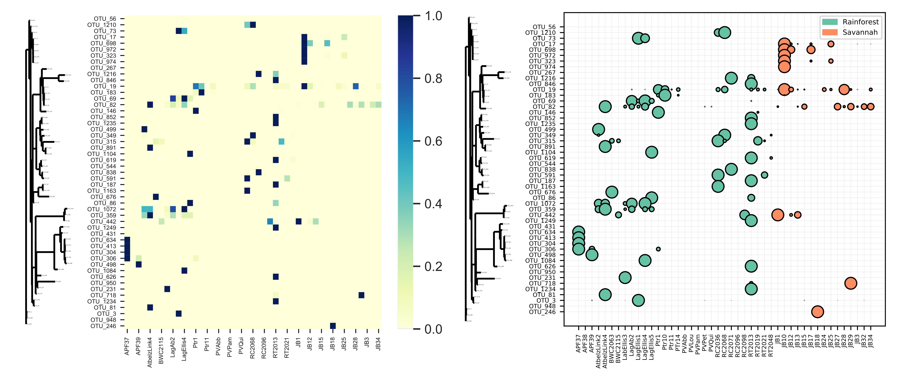

# Bubble Tree

[](https://doi.org/10.5281/zenodo.5114948)



BubbleTree generates a Cleveland dot plot or heatmap ordered by a corresponding phylogenetic tree. Required input: a tab separated frequency table (i.e., with taxa as rows and samples as columns), a newick, nexus, nexml, phyloxml, or cdao formated tree, and a tab separated file with sample metdata. See example files for formatting requirements.

### Prerequisites

Bubble tree is written with python 3+ and relies on the following packages:

* [BioPython](https://biopython.org/) 
* [Matplotlib](https://matplotlib.org/)
* [Pandas](https://pandas.pydata.org/)
* [Numpy](http://www.numpy.org/)
* [Seaborn](https://seaborn.pydata.org/)

### Install with pip

```
pip install bubbletree
```

### Install with conda

```
conda install -c aemann01 bubbletree
```

### Examples
Generate a heatmap figure ordered by the mapping.txt column Habitat2
```
bubbletree.py -i examples/biom.txt -t examples/tree.tre -m examples/map.txt -c Habitat2 -d heatmap -s sampleID -a ASVID
```

Generate a bubble chart figure colored and ordered by the mapping.txt column Species and view the tree structure in ASCII format to screen
```
bubbletree.py -i examples/biom.txt -t examples/tree.tre -m examples/map.txt -c Species -d bubblechart -p True -s sampleID -a ASVID
```

Generate a bubble chart figure colored and ordered by the mapping.txt column Genus on a remote cluster (Disables the automatic $DISPLAY environment varible used by matplotlib)
```
bubbletree.py -i examples/biom.txt -t examples/tree.tre -m examples/map.txt -c Genus -d bubblechart -r True -s sampleID -a ASVID
```

Help and parameter description
```
bubbletree.py -h
```
